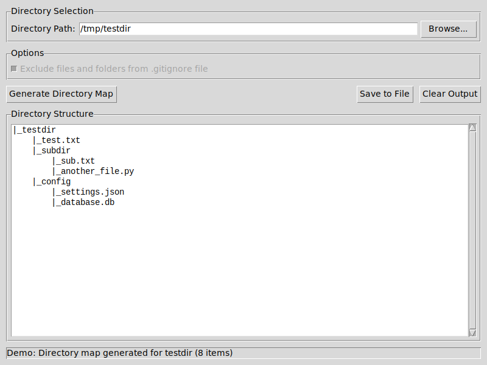

# Directory Mapper

A simple tool to generate a text-based map of any directory's structure, with an optional `.gitignore`-based exclusion feature. Now featuring both CLI and GUI interfaces!

---

## 🚀 Features

- **Directory Tree Mapping**: Recursively walks through a given folder and outputs a neat, indented tree view.
- **Optional `.gitignore` Exclusion**: Detects a `.gitignore` file in the target folder and prompts you whether to exclude matching files/folders (default: **Yes**).
- **Dual Interface**: Choose between a modern GUI or traditional CLI interface.
- **Easy to Use**: Browse directories with file dialogs or enter paths manually.
- **Live Preview**: See the directory structure immediately in the GUI.
- **Flexible Output**: Save to custom locations or use the default `directory_map.txt`.

---

## 📦 Installation

### 1. Clone the Repository

```bash
git clone https://github.com/anuradha2025/directory-mapper.git
cd directory-mapper
```

### 2. (Optional) Create a Virtual Environment

```bash
python -m venv venv
source venv/bin/activate   # Linux/macOS
venv/Scripts/activate  # Windows
```

### 3. Install Dependencies

This project uses only Python's standard library. For the GUI interface, ensure tkinter is installed:

**Linux (Ubuntu/Debian):**
```bash
sudo apt install python3-tk
```

**Windows/macOS:** tkinter is included with Python by default.

---

## ⚙️ Usage

### Quick Start (GUI - Recommended)

```bash
python run.py
```

This launches the graphical interface where you can:
1. **Browse** for directories using the file dialog
2. **Configure** .gitignore exclusion with a simple checkbox  
3. **Preview** the directory structure in real-time
4. **Save** the output to any location you choose

### Command Line Interface

```bash
python run.py cli
```

Or use the original script directly:
```bash
python dirmap.py
```

1. **Enter the target directory path**, e.g. `C:/Projects/MyRepo`.
2. If a `.gitignore` file is present, you'll be asked:

   > Exclude files and folders from the .gitignore file? [Y/n]

   - **Y** (default): Patterns from `.gitignore` will be honored.
   - **N**: All files/folders will be included.

3. After completion, check `directory_map.txt` in your current working directory for the tree output.

### Help

```bash
python run.py --help
```

---

## 🖼️ GUI Interface

The GUI provides an intuitive interface with the following features:

- **Directory Selection**: Browse button and text field for easy directory selection
- **Options Panel**: Checkbox to enable/disable .gitignore exclusion
- **Live Output**: Real-time preview of the directory structure
- **Save Functionality**: Save output to custom locations
- **Status Updates**: Real-time feedback during processing



---

## 📁 File Structure

```
directory-mapper/
├── dirmap.py                 # Core mapping functionality
├── directory_mapper_gui.py   # Tkinter GUI interface
├── run.py                    # Main entry point (GUI/CLI launcher)
├── test_gui.py              # Test suite for GUI functionality
├── README.md                # This file
└── LICENSE                  # MIT License
```

---

## 🧪 Testing

Run the test suite to verify everything works correctly:

```bash
python test_gui.py
```

This will test:
- GUI module imports
- Core directory mapping functionality  
- GUI initialization and components

---

## 🤝 Contributing

Contributions are welcome! Please:

1. Fork the repo.
2. Create a feature branch: `git checkout -b feature/my-feature`.
3. Commit your changes: `git commit -am "Add feature X"`.
4. Push to your branch: `git push origin feature/my-feature`.
5. Open a Pull Request.

Please ensure your code follows PEP 8 styling.

---

## 📄 License

This project is licensed under the MIT License. See [LICENSE](LICENSE) for details.

---

## ✉️ Contact

Created and maintained by [Anuradha](https://github.com/anuradha2025). Feel free to open issues or reach out via GitHub.